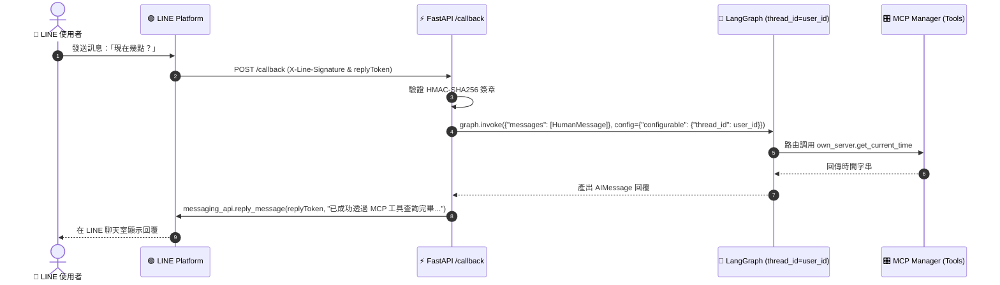

# Development Log: Special Detour — LINE Webhook Gateway x LangGraph

## 1. Meta Information

- **Date:** 2026-08-16
- **Phase:** Special Detour — LINE UI Interface
- **Task ID:** DETOUR-LINE-01
- **Task Title:** LINE Webhook Gateway with FastAPI, Signature Verification & LangGraph Thread Isolation
- **Status:** COMPLETED

---

## 2. Goal

實作以 FastAPI 為基礎的 LINE 通訊轉接閘道器（[`app/interfaces/line_gateway.py`](file:///e:/code/ive/M.Ber/app/interfaces/line_gateway.py)），完成：
1. 建立 `POST /callback` Webhook 端點，支援 HMAC-SHA256 簽章驗證（`X-Line-Signature`）。
2. 提取 `user_id` 作為 LangGraph 的 `thread_id`，搭配 `MemorySaver` 確保不同使用者具備獨立且連續的對話記憶。
3. 支援將敏感金鑰從 `.env` 檔案載入，並在 [`.env.example`](file:///e:/code/ive/M.Ber/.env.example) 提供範本。
4. 確保 LINE Gateway 作為純適配器層，與 LangGraph 核心邏輯保持完全解耦（Decoupling）。
5. 建立完整的單元測試套件 [`tests/test_line_gateway.py`](file:///e:/code/ive/M.Ber/tests/test_line_gateway.py)，並確保 29/29 測試全數通過。

---

## 3. Architecture Note (Decoupling & Modularity)

本次實作將 LINE 相關邏輯隔離在 `app/interfaces/` 目錄：
- **邊界隔離**：LangGraph Core（`app/agent/`）與 MCP Manager（`app/mcp/`）完全不需要知道 LINE SDK 的存在。
- **統一介面**：LINE Gateway 僅將收到的訊息轉換為標準的 `HumanMessage` 送入 Graph，並取回 `AIMessage` 的字串內容。
- **可擴展性**：未來要接入 Discord、Slack、Telegram 或 Web UI，只需在 `app/interfaces/` 增加新的適配器，無需變動核心 Agent 邏輯。

---

## 4. Files Changed

| File | Status | Description |
| :--- | :--- | :--- |
| `app/interfaces/line_gateway.py` | Created | FastAPI LINE Webhook 進入點、簽章檢查與 LangGraph 轉發 |
| `app/interfaces/__init__.py` | Created | Interfaces 模組初始化 |
| `app/agent/graph.py` | Modified | `create_agent_graph` 支援 `checkpointer` 參數 |
| `.env.example` | Modified | 新增 `LINE_CHANNEL_ACCESS_TOKEN` 與 `LINE_CHANNEL_SECRET` |
| `tests/test_line_gateway.py` | Created | LINE Gateway 單元測試（健康檢查、簽章防護、記憶隔離） |
| `CHANGELOG_AI.md` | Modified | 遵循 Special Detour 規範記錄變更與解耦備註 |
| `docs/development-log/2026-08-16-special-detour-line-gateway.md` | Created | 本次開發日誌 |

---

## 5. Sequence Diagram



---

## 6. Test Results

執行指令：
```powershell
uv run --extra dev pytest
```

輸出結果：
```text
============================= test session starts =============================
platform win32 -- Python 3.14.4, pytest-9.1.1, pluggy-1.6.0
rootdir: E:\code\ive\M.Ber
configfile: pyproject.toml
testpaths: tests

tests/test_agent_graph.py::test_graph_compilation PASSED                 [  3%]
tests/test_agent_graph.py::test_router_should_continue PASSED            [  6%]
tests/test_agent_graph.py::test_normal_chat_execution_flow PASSED        [ 10%]
tests/test_agent_graph.py::test_tool_calling_execution_flow PASSED       [ 13%]
tests/test_agent_graph.py::test_dummy_tool_implementations PASSED        [ 17%]
tests/test_agent_graph.py::test_custom_mock_llm_injection PASSED         [ 20%]
tests/test_line_gateway.py::test_line_gateway_health_check PASSED        [ 24%]
tests/test_line_gateway.py::test_line_gateway_missing_signature PASSED   [ 27%]
tests/test_line_gateway.py::test_line_gateway_invalid_signature PASSED   [ 31%]
tests/test_line_gateway.py::test_line_gateway_valid_webhook_event_processing PASSED [ 34%]
tests/test_line_gateway.py::test_line_gateway_multi_user_thread_isolation PASSED [ 37%]
tests/test_mcp_integration.py::test_agent_graph_with_mcp_get_current_time PASSED [ 41%]
tests/test_mcp_integration.py::test_agent_graph_with_mcp_echo_message PASSED [ 44%]
tests/test_mcp_manager.py::test_mcp_manager_initialization_and_tool_discovery PASSED [ 48%]
tests/test_mcp_manager.py::test_mcp_manager_multi_server_routing PASSED  [ 51%]
tests/test_mcp_manager.py::test_mcp_manager_safety_level_evaluation PASSED [ 55%]
tests/test_mcp_server.py::test_mcp_server_list_tools PASSED              [ 58%]
tests/test_mcp_server.py::test_mcp_server_call_get_current_time PASSED   [ 62%]
tests/test_mcp_server.py::test_mcp_server_call_echo_message PASSED       [ 65%]
tests/test_mcp_third_party.py::test_sqlite_server_add_and_read_notes_flow PASSED [ 68%]
tests/test_mcp_third_party.py::test_agent_graph_with_third_party_add_note PASSED [ 72%]
tests/test_mcp_third_party.py::test_agent_graph_with_third_party_read_notes PASSED [ 75%]
tests/test_smoke.py::test_python_version PASSED                          [ 79%]
tests/test_smoke.py::test_core_dependencies_import PASSED                [ 82%]
tests/test_smoke.py::test_app_package_import PASSED                      [ 86%]
tests/test_smoke.py::test_project_spec_exists PASSED                     [ 89%]
tests/test_smoke.py::test_agents_rule_exists PASSED                      [ 93%]
tests/test_smoke.py::test_readme_exists PASSED                           [ 96%]
tests/test_smoke.py::test_pyproject_toml_exists PASSED                   [100%]

============================= 29 passed in 43.69s =============================
```
**結果：29/29 測試全數通過（Passed）。**
